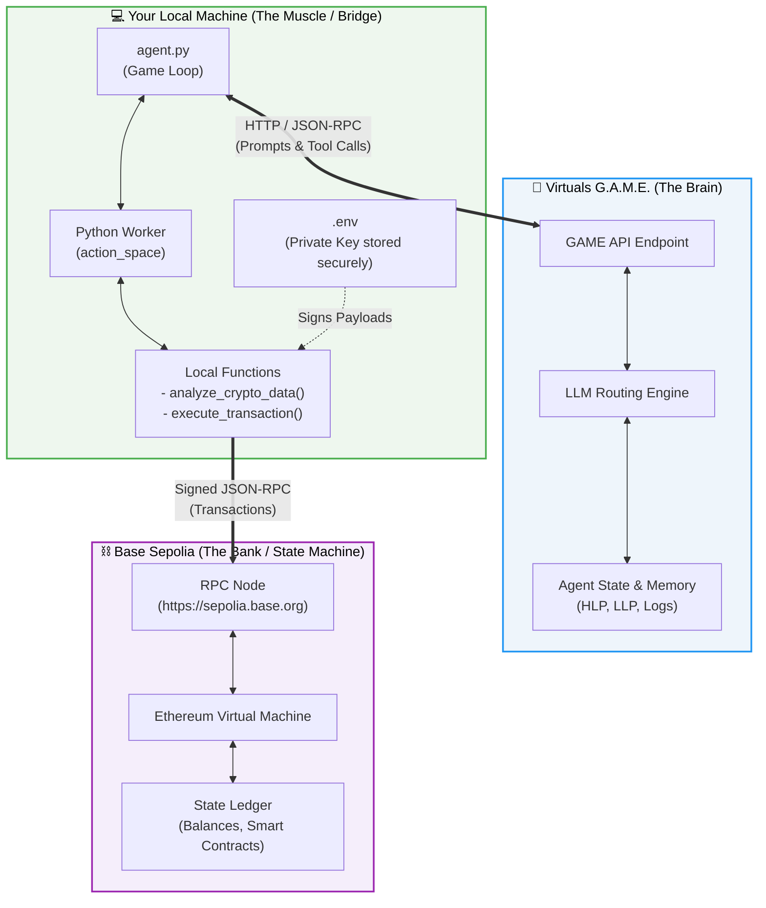
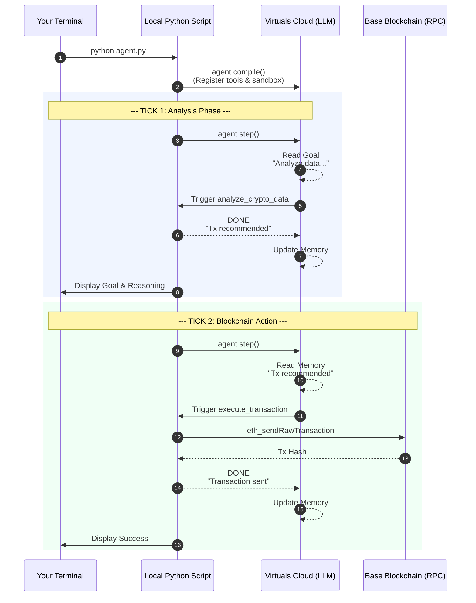

# 🧠 Hybrid LLM Agent-to-Agent (A2A) Node  
### Cloud Intelligence × Local Execution × On-Chain Settlement
### Local Python Agent connected to Virtuals GAME SDK + Base Sepolia


This repository demonstrates a **hybrid autonomous agent architecture** in which:

- A **local Python agent** provides real execution capabilities
- A **cloud-based LLM (Virtuals GAME)** performs reasoning and routing
- The agent can trigger blockchain actions on **Base Sepolia**

It showcases a hybrid architecture:

- 🧠 Reasoning is performed by a cloud-hosted LLM (Virtuals GAME)
- 💻 Execution capabilities remain local in Python
- ⛓️ Final state transitions settle on Base Sepolia

The project illustrates how to safely combine:

- Tool-based LLM orchestration
- Local private key isolation
- Structured agent memory handling
- On-chain transaction execution

This is a minimal but extensible blueprint for building autonomous Web3 agents.
---

# 🏗 Architecture Overview

## System-Level Overview



---

# 🔄 Agentic Execution Flow


---

# 🧪 Architectural Properties

### Deterministic Execution Boundary
LLM reasoning is non-deterministic.  
Local tool execution remains deterministic and auditable.

### Secure Key Isolation
Private keys never leave the local machine.  
The cloud LLM only decides *what* to do — not *how to sign*.

### Agent Memory as State Machine
The agent’s HLP/LLP memory logs function as a soft state machine, enabling:

- Multi-step reasoning
- Emergent goal transitions
- Conditional tool routing

### Extensibility
Additional workers can be attached to expand capability:

- Market execution
- DAO governance interaction
- Cross-agent payment settlement
- Oracle data ingestion

---

# 🧩 What This Project Demonstrates

### ✅ Cloud-Local Hybrid Agent Architecture  
LLM reasoning lives in the cloud.  
Execution power lives locally.

### ✅ Tool Registration via GAME SDK  
Local Python functions are exposed as structured callable tools.

### ✅ State & Memory Handling  
Agent state is extracted robustly from `agent.step()` responses.

### ✅ Secure Private Key Handling  
Private keys remain local inside `.env` and never leave your machine.

### ✅ A2A Decision Loop  
Agent analyzes → recommends → executes → updates memory.

---

# 📂 Project Structure

```
.
├── agent.py
├── .env
├── requirements.txt
└── README.md
```

---

# ⚙️ Installation

## 1️⃣ Clone the repository

```bash
git clone https://github.com/YOUR_USERNAME/YOUR_REPO.git
cd YOUR_REPO
```

## 2️⃣ Create virtual environment

```bash
python -m venv venv
source venv/bin/activate  # macOS / Linux
venv\Scripts\activate     # Windows
```

## 3️⃣ Install dependencies

```bash
pip install -r requirements.txt
```

---

# 🔐 Environment Variables

Create a `.env` file:

```
GAME_API_KEY=your_virtuals_api_key
PRIVATE_KEY=your_wallet_private_key
```

Add this to `.gitignore`:

```
.env
```

---

# ▶️ Run the Agent

```bash
python agent.py
```

You will see:

- Agent goal
- LLM reasoning
- Tool execution
- Memory updates
- Function results

---

# 🚀 Why This Matters

This architecture enables:

- Autonomous agents with real-world execution
- Secure key isolation
- Composable AI + Web3 workflows
- Agent-to-Agent economies

It’s a minimal but powerful demonstration of **LLM-driven blockchain agents**.

---

# 📜 License

MIT License

---

# 👤 Author

Built as an experimental A2A prototype combining:

- Python execution
- Virtuals GAME SDK
- Base Sepolia network