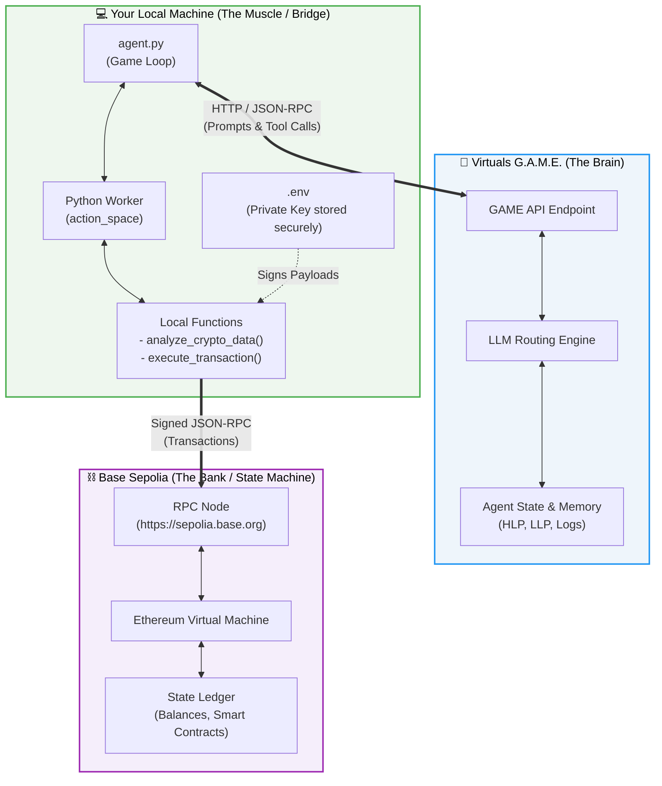
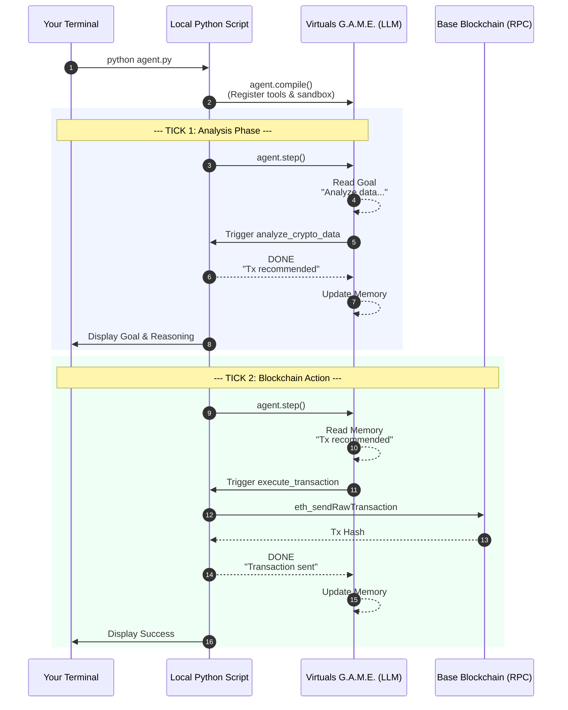

# 🧠 Hybrid LLM Agent-to-Agent (A2A) Node
### Cloud Intelligence × Local Execution × On-Chain Settlement


A minimal but extensible blueprint for building **autonomous Web3 agents**, combining cloud LLM reasoning with local Python execution and on-chain settlement on Base Sepolia.

- 🧠 **Reasoning** — Cloud-hosted LLM via [Virtuals G.A.M.E.](https://console.game.virtuals.io/)
- 💻 **Execution** — Local Python with private key isolation
- ⛓️ **Settlement** — Final state transitions on Base Sepolia

---

## 🏗 Architecture



---

## 🔄 Agentic Execution Flow



---

## 🧪 Architectural Properties

**Deterministic Execution Boundary** — LLM reasoning is non-deterministic; local tool execution remains deterministic and auditable.

**Secure Key Isolation** — Private keys never leave the local machine. The cloud LLM only decides *what* to do — not *how to sign*.

**Agent Memory as State Machine** — The agent's HLP/LLP memory logs function as a soft state machine, enabling multi-step reasoning, emergent goal transitions, and conditional tool routing.

**Extensibility** — Additional workers can be attached to expand capability: market execution, DAO governance interaction, cross-agent payment settlement, oracle data ingestion.

---

## 📂 Project Structure

```
.
├── agents/
│   └── agent.py              # Main A2A game loop
│
├── tools/
│   ├── analyze.py            # analyze_crypto_data() and similar
│   └── transactions.py       # execute_transaction() logic
│
├── workers/
│   └── action_space.py       # Tool registration / worker wiring for GAME SDK
│
├── scripts/
│   ├── app.py                # Early prototype / REST entry point
│   └── send_tx.py            # Standalone transaction utility
│
├── .env
├── requirements.txt
└── README.md
```

The structure separates **what the agent does** (`tools/`) from **how it's orchestrated** (`agents/`) and **how tools are exposed** to the G.A.M.E. SDK (`workers/`). The `scripts/` folder preserves the original prototype files for reference.

As the project grows, new capabilities slot in cleanly — e.g. `agents/market_agent.py`, `tools/oracle.py`, or `workers/dao_worker.py`.

---

## ⚙️ Installation

**1. Clone the repository**

```bash
git clone https://github.com/YOUR_USERNAME/YOUR_REPO.git
cd YOUR_REPO
```

**2. Create virtual environment**

```bash
python -m venv venv
source venv/bin/activate  # macOS / Linux
venv\Scripts\activate     # Windows
```

**3. Install dependencies**

```bash
pip install -r requirements.txt
```

---

## 🔐 Environment Variables

Create a `.env` file:

```
GAME_API_KEY=your_virtuals_game_api_key   # Get yours at https://console.game.virtuals.io/
PRIVATE_KEY=your_wallet_private_key
```

Add `.env` to your `.gitignore` to ensure your private key is never committed.

---

## ▶️ Running the Agent

```bash
python agent.py
```

The terminal will display the agent's goal, LLM reasoning, tool execution steps, memory updates, and function results in real time.

---

## 📜 License

MIT License

---

## 👤 Author

**Raimund Kammering**

Experimental A2A prototype combining Python execution, [Virtuals G.A.M.E. SDK](https://console.game.virtuals.io/), and Base Sepolia.

Public wallet: `0x072C12957983104891DCEB9C1C90dD94eda7Ca8C`
